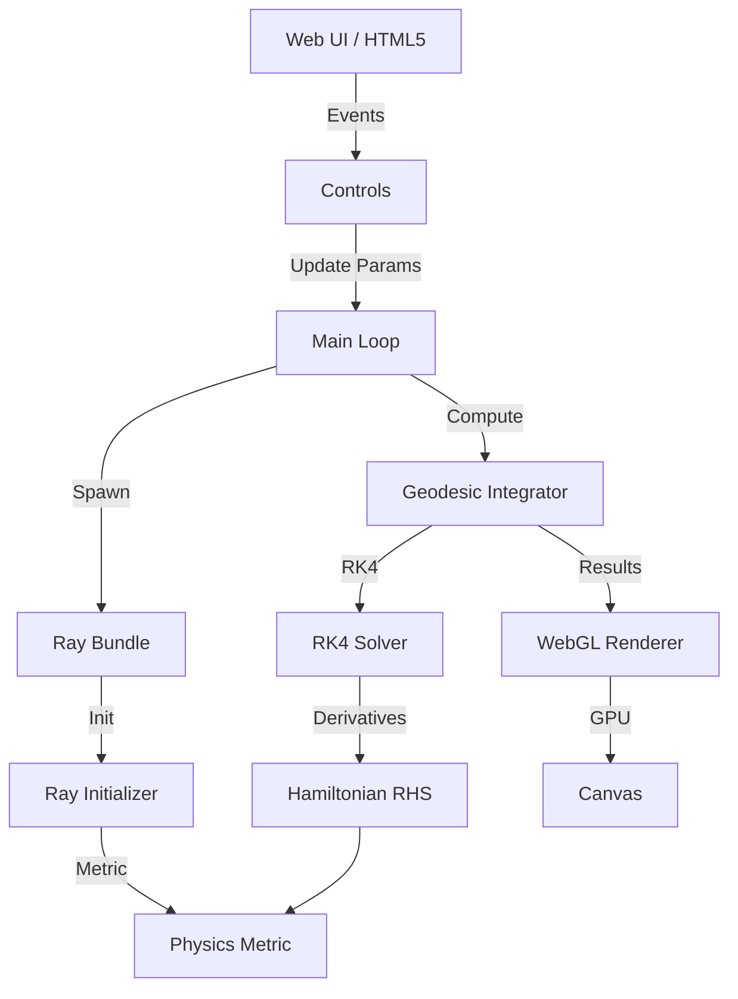

# System Architecture

The Schwarzschild Geodesic Visualization is built as a high-performance C++/WebGL application that simulates light trajectories in strong-field gravity.

## Component Overview

The system is divided into five main layers:

### 1. Application Layer (`src/app`)
*   **Entry Point**: `main.cpp` manages the Emscripten main loop and WebGL context.
*   **Controls**: `controls.cpp` handles user interaction (keyboard/mouse).
*   **Caching**: Implements an LRU cache for geodesics to maximize performance during parameter tweaks.

### 2. Physics Engine (`src/physics`)
*   **Metric**: `schwarzschild_metric.cpp` defines the spacetime geometry (coefficients and analytic derivatives).
*   **Hamiltonian**: `hamiltonian.cpp` implements the equations of motion derived from the Hamiltonian formulation.

### 3. Numerical Integration (`src/numerics`)
*   **Integrator**: `integrator.cpp` manages the 4th-order Runge-Kutta (RK4) evolution.
*   **Diagnostics**: Monitors Hamiltonian constraints and conserved quantities (Energy, Angular Momentum) to ensure physical accuracy.

### 4. Ray Management (`src/rays`)
*   **Ray Initializer**: Sets up initial position and momentum $(x, p)$ ensuring the null condition $H=0$.
*   **Ray Bundle**: Manages sets of rays (2D equatorial or 3D spherical shells).

### 5. Rendering Engine (`src/render`)
*   **Camera**: Handles spherical orbital navigation.
*   **Geometry Generator**: Creates meshes for the horizon, photon sphere, and starfield.
*   **Renderer**: WebGL2 implementation with support for bloom post-processing and multiple color-mapping modes.

---

## Data Flow

## Parallelization (Web Workers)

The simulation supports off-main-thread computation via `worker_bindings.cpp`. This allows the UI to remain responsive while heavy geodesic integration occurs in the background across multiple cores.
