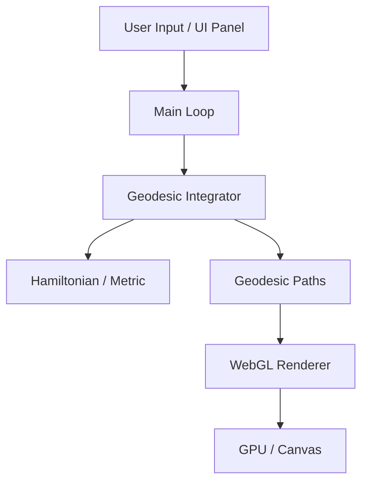

# System Architecture

The Schwarzschild Geodesic Visualization is a C++ application targeting WebAssembly/WebGL2 for real-time simulation of light trajectories in curved spacetime.

## Component Overview

### 1. Application Layer (`src/app`)
*   **Main Loop**: `main.cpp` manages the Emscripten main loop and coordinates between physics and rendering.
*   **Controls**: `controls.cpp` implements mouse interaction and a subset of keyboard shortcuts.
*   **Web Interface**: `index.html` provides the primary control panel for simulation parameters.

### 2. Physics Engine (`src/physics`)
*   **Metric**: `schwarzschild_metric.cpp` provides the metric tensor components and analytic derivatives.
*   **Hamiltonian**: `hamiltonian.cpp` defines the relativistic equations of motion.

### 3. Numerical Integration (`src/numerics`)
*   **RK4 Solver**: Standard 4th-order Runge-Kutta implementation.
*   **Geodesic Integrator**: Manages state evolution, constraint monitoring, and termination heuristics.

### 4. Ray Management (`src/rays`)
*   **Ray Initializer**: Calculates initial phase-space $(x, p)$ vectors satisfying the null condition $H=0$.
*   **Ray Bundle**: Orchestrates batch initialization for equatorial grids or spherical shells.

### 5. Rendering Engine (`src/render`)
*   **WebGL Renderer**: Handles GLES3 primitive dispatch and shader management.
*   **Geometry**: Generates scene meshes including the horizon, photon sphere, and accretion diskISCO plane.

---

## Data Flow

## Implementation Notes

- **Integration**: The system uses a fixed-step solver with proximity-aware scaling rather than a formal adaptive error-estimated integrator.
- **Extensibility**: The codebase includes bindings for web workers and post-processing shaders, which can be enabled for advanced use cases or multi-threaded background processing.
